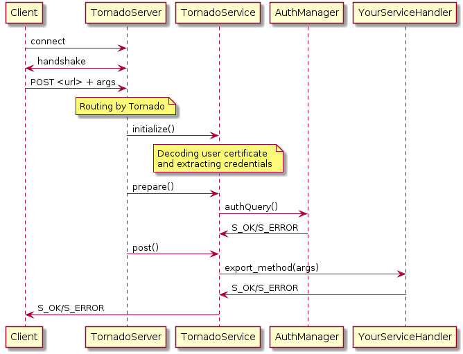

===========================
HTTPS Services with Tornado
===========================

*******
Service
*******

.. graphviz::

   digraph {
   TornadoServer -> YourServiceHandler [label=use];
   YourServiceHandler ->  TornadoService[label=inherit];
   

   TornadoServer  [shape=polygon,sides=4, label = "DIRAC.TornadoServices.Server.TornadoServer"];
   TornadoService  [shape=polygon,sides=4, label = "DIRAC.TornadoServices.Server.TornadoService"];
   YourServiceHandler  [shape=polygon,sides=4];

   }

******
Client
******

.. graphviz::

   digraph {
   TornadoClient  [shape=polygon,sides=4];
   }

Client send HTTP POST request with:

- procedure: str with procedure name
- args: arguments in JSON

*****************************
Client / Service interactions
*****************************

